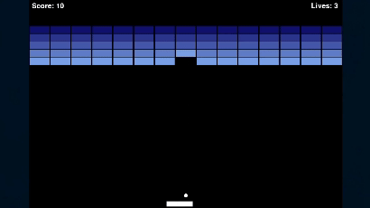

# Breakout Game 🎮

A classic Breakout-style arcade game built using Python and Pygame. Destroy blocks, keep the ball in play, and rack up the highest score possible before running out of lives!

## Features

- Paddle and ball mechanics
- Blocks with hit points and color variation
- Scoreboard with live score and remaining lives
- Game Over screen
- Smooth movement and basic physics

## Gameplay


## How to Play

- Move the paddle left: **A**
- Move the paddle right: **D**
- Prevent the ball from falling below the paddle
- Break all blocks to win!

## Setup

### 1. Clone or download the project

```bash
git clone https://github.com/your-username/breakout-game.git
cd breakout-game
```

### 2. Install dependencies

```bash
pip install -r requirements.txt
```
### 3. Run the game

```bash
python main.py
```

## Project Structure
```css
.
├── main.py
├── ball.py
├── paddle.py
├── block.py
├── scoreboard.py
├── requirements.txt
└── README.md
```

## License

MIT – feel free to modify and use!